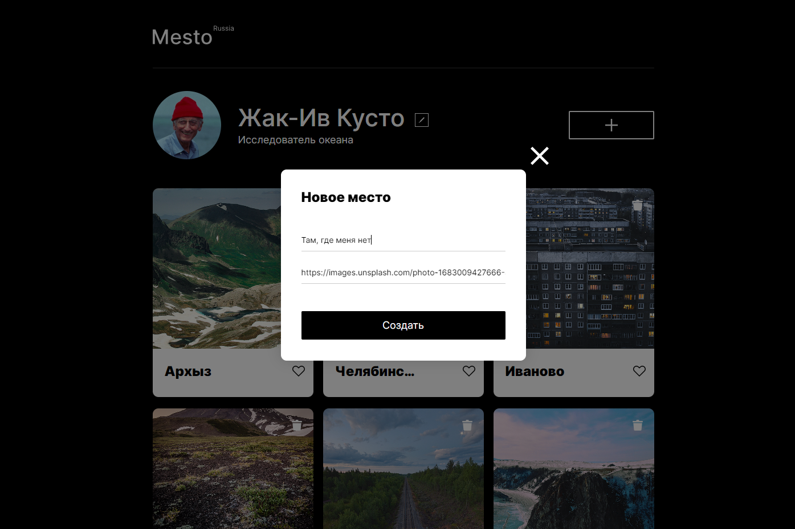

# Проект: MESTO
## Ссылка для просмотра *https://godsdan.github.io/mesto/*

 По состоянию на 25 июня 2023 года в России насчитывается 1119 городов. Масштабно, неправда ли? 

### Хватит наслаждаться курортами других стран, погнали изучать Россию!

 В данном проекте я хочу представить приложение, аналогичное запрещенному в Российской Федерации  Instagram. А данном приложении вы можете выставлять ваши собственные фотографии, ставить лайки на понравившиеся фото, менять информацию о себе, а так же устанавливать свое фото профиля. 

## Примеры и технологии

*Скрин сайта(на двух фото стоит лайк):*

 *В проекте реализована функция изменения данных профиля:*

 

 *В проекте реализована функция добавления новых карточек:*

 

 *Также картинку можно увеличить/поставить лайк/удалить*

 

## План по доработке

1. Сохранение изменений данных при обновлении
2. Личный кабинет
3. Изменение фото профиля.
